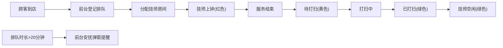

## 1. 产品概述

足疗店实时运营面板系统，为足疗门店提供多端实时运营可视化管理。包含门口大屏幕数据展示和前台平板管理两大界面，实时监控技师状态、上钟情况、房间状态、顾客排队等核心业务数据。

## 2. 核心功能

### 2.1 用户角色
| 角色 | 核心功能 |
|------|----------|
| 门店顾客 | 查看门口大屏幕数据展示 |
| 前台接待 | 管理上钟记录、顾客排队、房间状态 |

### 2.2 功能模块

1. **门口大屏幕页面**：空闲技师数量、今日已接待人数、今日营收、实时时钟
2. **前台平板页面**：上钟情况表格、技师状态展示、顾客排队列表、房间状态管理

### 2.3 页面详情

| 页面名称 | 模块名称 | 功能描述 |
|-----------|----------|----------|
| 门口大屏幕 | 数据看板 | 显示空闲技师数量(大号数字展示) |
| 门口大屏幕 | 数据看板 | 显示今日已接待人数 |
| 门口大屏幕 | 数据看板 | 显示今日营收金额 |
| 门口大屏幕 | 实时时钟 | 显示当前日期时间 |
| 前台平板 | 上钟表格 | 技师姓名、房间号、服务项目、已做时长、预计剩余时长 |
| 前台平板 | 技师状态 | 绿色空闲、红色上钟、黄色待打扫、灰色休息/吃饭 |
| 前台平板 | 顾客排队 | 顾客姓名、等待项目、等待时长(超过20分钟弹窗提醒 |
| 前台平板 | 房间状态 | 已打扫/待打扫/打扫中，保洁完成点击切换状态 |

## 3. 核心流程

## 4. 用户界面设计

### 4.1 设计风格

- **主色调**：深靛蓝色系作为主色，配合状态色(绿/红/黄/灰)
- **辅助色**：暖金色点缀，体现高端足疗店氛围
- **背景**：深色背景，深色主题，深色主题
- **字体**：现代无衬线字体，大号数字突出展示
- **按钮**：圆角卡片，柔和阴影
- **图标**：Lucide 图标库

### 4.2 页面设计概览

| 页面名称 | 模块名称 | UI元素 |
|-----------|----------|---------|
| 门口大屏幕 | 数据看板 | 深色渐变背景，大数字动画，状态色块 |
| 前台平板 | 上钟表格 | 表格行背景色根据状态变化，实时更新时间 |
| 前台平板 | 排队列表 | 超过20分钟行高亮红色，弹窗带脉冲动画 |
| 前台平板 | 房间状态 | 房间卡片，点击交互，状态颜色标识 |

### 4.3 响应式设计

- 门口大屏幕：全屏展示，适合横屏大屏展示，大屏显示，大字号
- 前台平板：平板竖屏/横屏自适应
