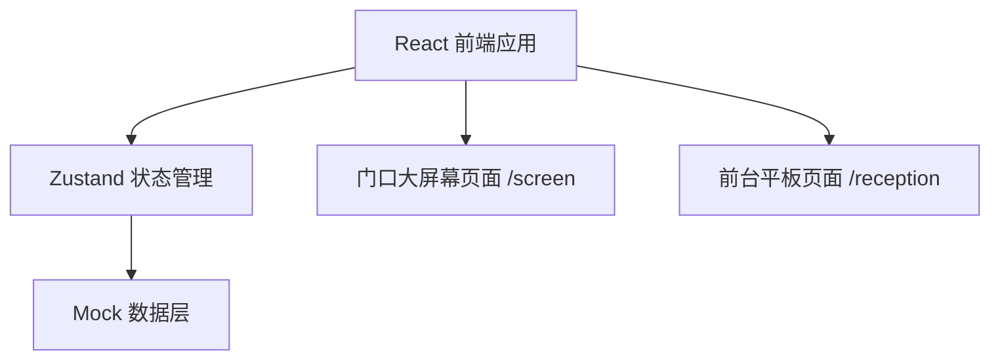

## 1. 架构设计



## 2. 技术说明

- 前端框架：React 18 + TypeScript + Vite
- 样式方案：TailwindCSS 3
- 状态管理：Zustand
- 路由方案：React Router DOM
- 图标库：Lucide React
- 数据来源：Mock 数据（本地模拟）

## 3. 路由定义

| 路由 | 用途 |
|------|------|
| /screen | 门口大屏幕数据展示大屏 |
| /reception | 前台平板管理页面 |
| / | 默认重定向到 /reception |

## 4. 数据模型

### 4.1 类型定义

```typescript
// 技师状态
type TechnicianStatus = 'idle' | 'working' | 'cleaning' | 'rest'

// 房间状态
type RoomStatus = 'cleaned' | 'to_clean' | 'cleaning'

// 技师
interface Technician {
  id: string
  name: string
  status: TechnicianStatus
  avatar?: string
}

// 房间
interface Room {
  id: string
  roomNumber: string
  status: RoomStatus
}

// 服务项目
interface Service {
  id: string
  name: string
  duration: number // 分钟
  price: number
}

// 上钟记录
interface Session {
  id: string
  technicianId: string
  roomId: string
  serviceId: string
  startTime: Date
  customerName: string
}

// 排队顾客
interface QueueCustomer {
  id: string
  name: string
  phone?: string
  serviceId: string
  joinTime: Date
}

// 今日统计
interface DailyStats {
  date: string
  totalCustomers: number
  totalRevenue: number
  sessionsCompleted: string[]
}
```

### 4.2 状态管理设计

```typescript
// Zustand Store
- technicians: Technician[]
- rooms: Room[]
- services: Service[]
- sessions: Session[]
- queue: QueueCustomer[]
- stats: DailyStats
- actions:
  - updateTechnicianStatus(id, status)
  - updateRoomStatus(id, status)
  - startSession(technicianId, roomId, serviceId, customerName)
  - endSession(sessionId)
  - addToQueue(name, serviceId)
  - removeFromQueue(id)
  - getWaitingTime(customerId)
```
